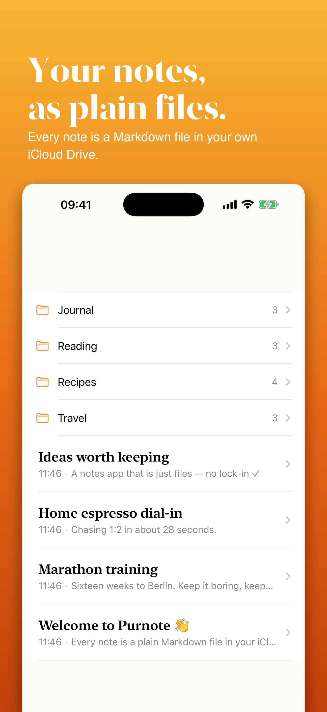
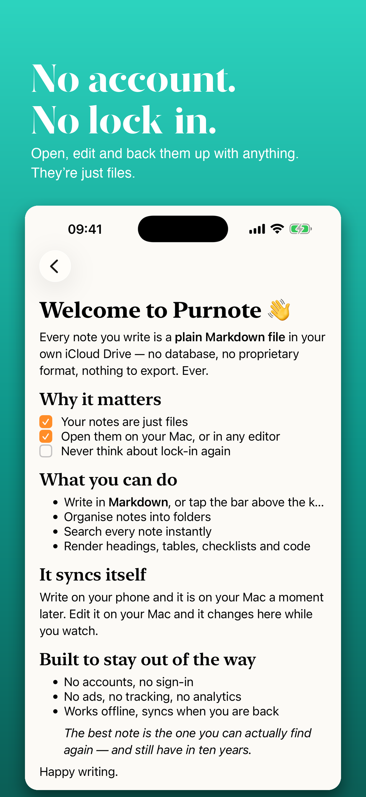
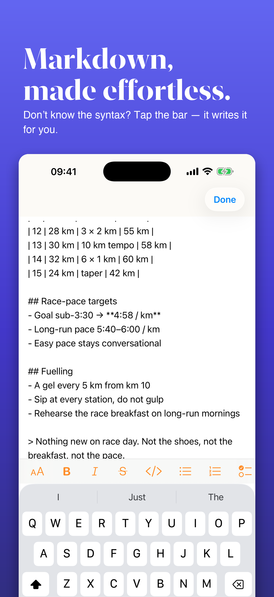
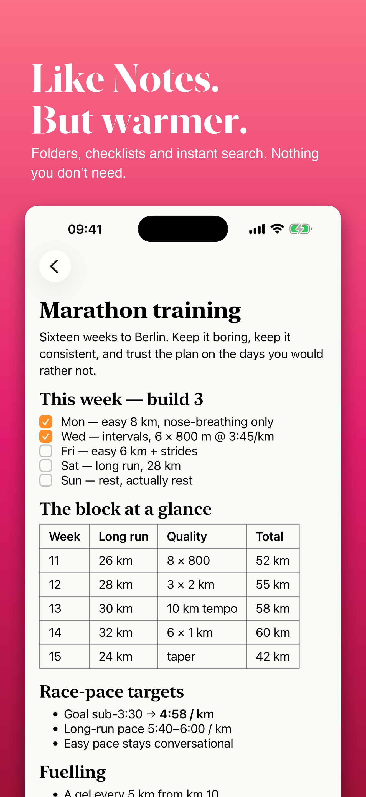
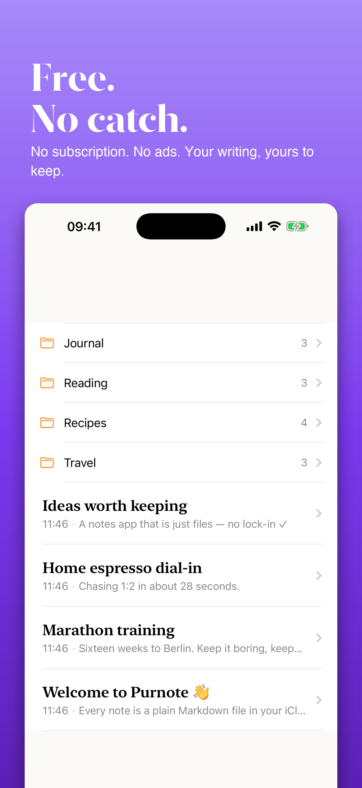

# Purnote

Purnote is a hobby iOS app I built for the purpose of learning Swift and SwiftUI.

It keeps your notes as plain `.md` files in iCloud Drive, in a directory called
"purnote". There is no database and no proprietary format — the files are the
app's only source of truth, so you can open, edit and back them up with anything
you like.

## Screenshots

  
  
  
  
  

## Features:

* take your notes and they get directly saved to the iCloud Drive, in the directory called "purnote"
* use the MarkDown notation for notes and they will be rendered by the App (thanks to project https://github.com/gonzalezreal/swift-markdown-ui by https://github.com/gonzalezreal)
* a formatting bar above the keyboard, so you don't have to know MarkDown by heart — headings, bold, italic, strikethrough, code, lists, checklists, quotes and links
* organize notes in folders
* notes get automatically synced with your Mac
* edit or create the notes directly on your Mac and they will be updated in the app
* search all your notes within the app. For this I've built a naive inverted implementations (naive because there's no score relevance) that indexes all your notes

The formatting buttons insert exactly the characters you would have typed
yourself, so writing the MarkDown by hand, tapping the buttons, or mixing the
two all end up with the same file. Nothing ever rewrites your notes behind your
back.

## Requirements

* iOS 18 or later
* Xcode 26 or later

## A note on the history

I wrote this in October 2020 against iOS 14, and then left it alone. It stopped
building somewhere along the way — not because of my code, but because a
dependency's vendored C library no longer compiled on modern clang.

It has since been brought back to life: the abandoned dependencies are gone
(two of them only ever worked around gaps that SwiftUI has long since closed),
the renderer moved from the unmaintained Parma to MarkdownUI, and the editor
grew the formatting bar. See issues #23 – #26.

The original iOS 14 version is preserved on the `ios14-original` branch, in case
anyone wants to see where it started.

You like this app?
Let me know by opening an issue 😊
